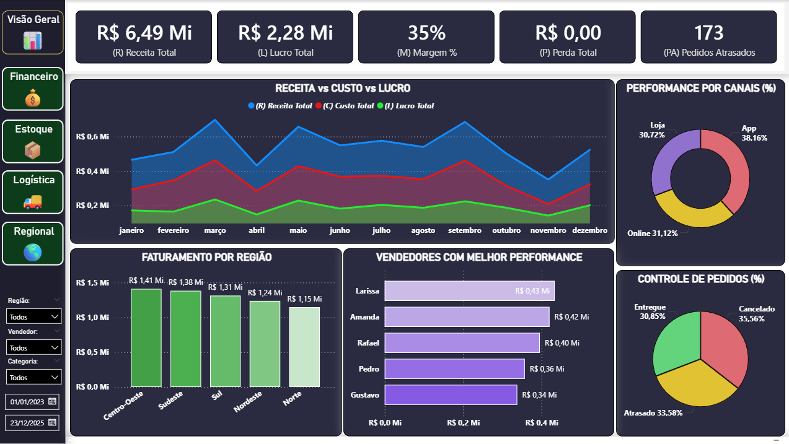
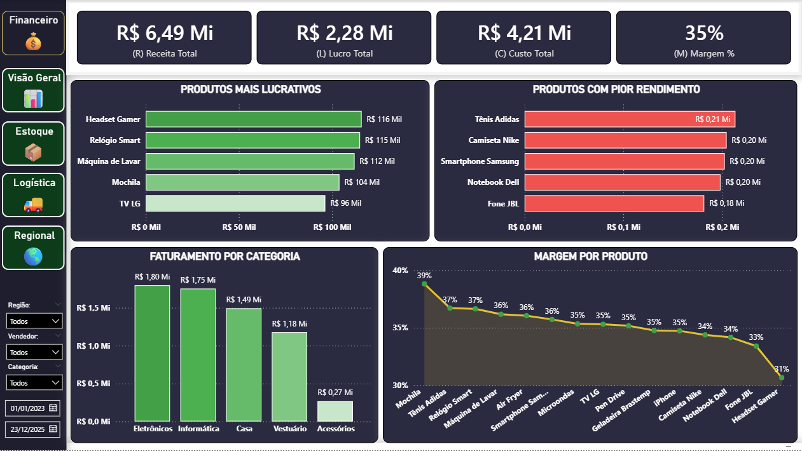
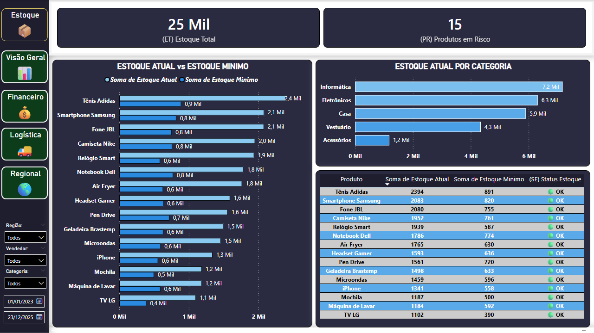
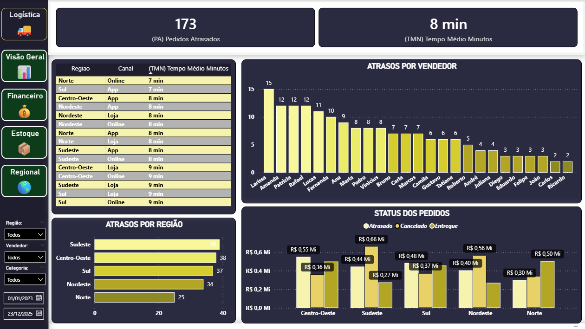
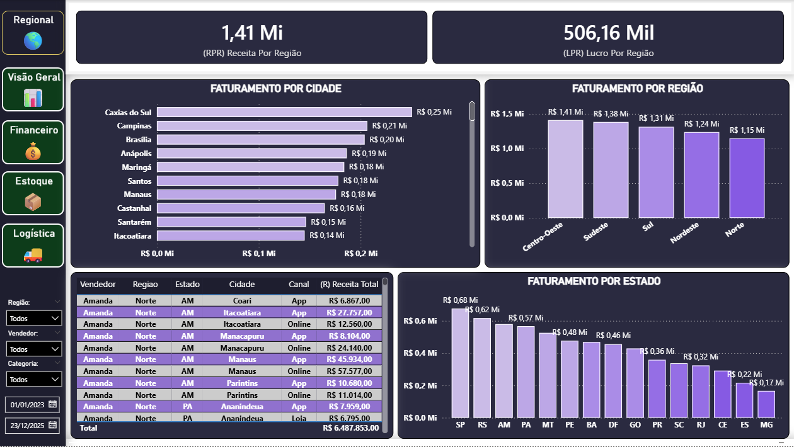
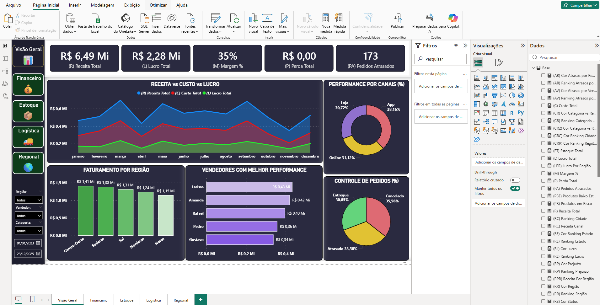

# 📊 Dashboard de Análise de Vendas, Estoque e Logística

## 🚀 Sobre o Projeto

Este projeto consiste no desenvolvimento de um dashboard completo no Power BI com foco em análise estratégica de vendas, desempenho financeiro, controle de estoque e eficiência logística.

O dashboard foi estruturado para simular um cenário real de negócio, permitindo a tomada de decisões baseada em dados de forma rápida, visual e interativa.

---

## 🔗 Integração com Excel

Os dados são alimentados através de uma planilha Excel conectada diretamente ao Power BI.

✔ Atualização automática  
✔ Dados dinâmicos  
✔ Simulação de ambiente corporativo real  

---

## 🎯 Objetivos do Dashboard

- Monitorar receita, lucro e margem
- Identificar produtos mais e menos lucrativos
- Controlar níveis de estoque
- Analisar atrasos logísticos
- Avaliar performance por região, canal e vendedor

---

## 📊 Estrutura do Dashboard

### 🔍 Visão Geral
- KPIs principais (Receita, Lucro, Margem, Perdas, Atrasos)
- Evolução: Receita vs Custo vs Lucro
- Vendas por canal
- Faturamento por região
- Top vendedores
- Status dos pedidos

---

### 💰 Financeiro
- Produtos mais lucrativos
- Produtos com pior desempenho
- Margem por produto
- Faturamento por categoria

---

### 📦 Estoque
- Estoque total
- Produtos em risco
- Comparação: Estoque Atual vs Estoque Mínimo
- Controle por categoria

---

### 🚚 Logística
- Pedidos atrasados
- Tempo médio de entrega (em minutos)
- Atrasos por vendedor
- Atrasos por região
- Status dos pedidos

---

### 🌎 Regional
- Receita por região
- Lucro por região
- Faturamento por estado
- Faturamento por cidade

---

## 🧠 Principais Insights

- Identificação de regiões com maior geração de receita
- Produtos com prejuízo impactando o resultado
- Diferença de desempenho entre canais de venda
- Gargalos logísticos com atrasos recorrentes
- Risco de ruptura de estoque em produtos específicos

---

## 🛠️ Tecnologias Utilizadas

- Power BI
- Excel
- DAX (Data Analysis Expressions)
- Power Query (M)

---

## 🎨 Diferenciais do Projeto

✔ Design moderno e intuitivo  
✔ Navegação por botões (UX)  
✔ Indicadores dinâmicos  
✔ Cores condicionais inteligentes  
✔ Estrutura baseada em dores reais do negócio  

---

## 📌 Conclusão

Este dashboard foi desenvolvido com foco em resolver problemas reais de negócio, oferecendo uma visão clara, interativa e estratégica para apoio à tomada de decisão.

---

## 👨‍💻 Autor

Projeto desenvolvido por Jocival Almeida
